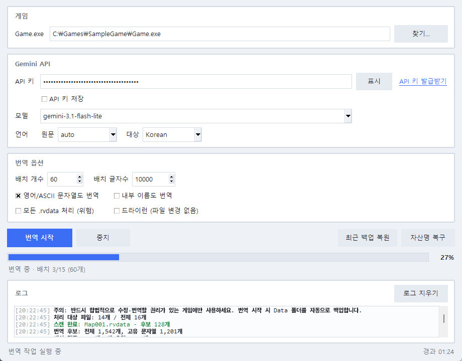

# RVX Gemini Translator

RPG Maker **VX / VX Ace** 게임의 `Game.exe`를 선택하면 `Data/*.rvdata`(VX)와 `Data/*.rvdata2`(VX Ace)에서 플레이어에게 보일 가능성이 높은 문자열을 찾아 Gemini API로 자동 번역하고 다시 저장하는 도구입니다. Ruby 없이 Ruby Marshal 구조를 직접 파싱하며, 원본 바이너리 구조를 그대로 보존한 채 문자열만 교체합니다.



## 다운로드

- **[Releases](../../releases)** 페이지에서 `RVX_Gemini_Translator.exe`를 받아 바로 실행할 수 있습니다. (Python 설치 불필요)
- 번역에는 [Google AI Studio](https://aistudio.google.com/apikey)에서 발급받는 무료 Gemini API 키가 필요합니다.

## 주요 기능

- **VX / VX Ace 지원** — `.rvdata`와 `.rvdata2` 모두 처리. VX Ace의 문자열 인코딩 구조(ivar)도 그대로 보존
- **번역 일관성 (용어집)** — 캐릭터/아이템/스킬 등 이름을 먼저 번역해 용어집을 만들고, 이후 대사·설명 번역에 자동 적용해 같은 고유명사가 항상 같은 번역으로 나오게 함
- **문맥 힌트** — 각 문자열이 대사인지, 선택지인지, 이름인지, 설명인지 카테고리를 함께 전달해 상황에 맞는 번역 유도
- **번역 지침** — 캐릭터 말투, 게임 톤 등 자유 지침을 적으면 모든 번역 요청에 반영 (예: "주인공은 반말, 집사는 극존댓말")
- **자동 백업** — 번역 시작 전 `Data` 폴더 전체를 `Data_backup_before_gemini_YYYYMMDD_HHMMSS`로 자동 백업
- **실제 진행률 표시** — 스캔/번역/저장 단계별 퍼센트와 배치 진행 상황, 경과 시간 표시
- **안전한 중지** — 번역 도중 언제든 중지 가능. 이미 번역된 문자열은 캐시에 저장되어 재실행 시 이어서 진행
- **번역 캐시** — 같은 문자열은 다시 요청하지 않아 재실행·재시도 시 비용과 시간 절약
- **위험 문자열 보호** — `Scripts.rvdata`, 오디오/그래픽 파일명(`RPG::SE/BGM/BGS/ME` 등), 이동 루트 등은 기본적으로 건드리지 않음
- **복구 기능** — 최근 백업 전체 복원 / 대사 번역은 유지하고 자산 파일명만 되돌리는 자산명 복구
- **설정 저장** — 게임 경로, 모델, 배치 설정 등을 자동 저장 (`%APPDATA%\RVXGeminiTranslator`)
- **견고한 응답 파싱** — Gemini가 JSON 대신 배열·번호 줄·깨진 JSON을 반환해도 최대한 파싱하고, 실패한 배치는 자동으로 더 작게 나눠 재시도

## 주의

- **합법적으로 수정·번역할 권리가 있는 게임에만 사용하세요.**
- 번역 대상 텍스트가 Gemini API로 전송됩니다.
- RPG Maker VX(`.rvdata`)와 VX Ace(`.rvdata2`)를 지원합니다. XP(`.rxdata`)와 MV/MZ(JSON)는 지원하지 않습니다.
- 문제가 생기면 GUI의 `최근 백업 복원` 버튼 또는 CLI의 `--restore-latest-backup`으로 되돌릴 수 있습니다.

## 사용법 (GUI)

1. `RVX_Gemini_Translator.exe`를 실행합니다. (또는 `python rvx_gemini_translator.py`)
2. `Game.exe` — 번역할 RPG Maker VX 게임의 실행 파일을 선택합니다.
3. `API 키` — [Google AI Studio](https://aistudio.google.com/apikey)에서 발급받은 Gemini API 키를 입력합니다. `API 키 저장`을 체크하면 다음 실행 시 자동으로 입력됩니다.
4. 필요하면 모델(기본 `gemini-3.1-flash-lite`), 언어(원문 `auto` → 대상 `Korean`), 배치 설정을 조정합니다.
5. `번역 시작`을 누릅니다. 시작 전 `Data` 폴더가 자동으로 백업됩니다.

처음 사용한다면 `드라이런` 옵션을 켜고 한 번 실행해 어떤 문자열이 번역 대상인지 보고서로 확인해 보는 것을 권장합니다. 드라이런은 API 키 없이도 동작합니다.

## Python으로 실행

Windows에서 Python 3.10 이상 설치 후:

```bat
python -m pip install -r requirements.txt
python rvx_gemini_translator.py
```

## CLI 사용법

```bat
set GEMINI_API_KEY=YOUR_KEY_HERE
python rvx_gemini_translator.py --exe "C:\Games\SampleGame\Game.exe" --source auto --target Korean
```

자주 쓰는 옵션:

| 옵션 | 설명 |
|---|---|
| `--dry-run` | 파일을 바꾸지 않고 번역 후보만 스캔해 보고서 생성 |
| `--batch-size`, `--batch-chars` | 요청당 문자열 수/글자 수 (기본 60 / 10000) |
| `--no-ascii` | 영어처럼 보이는 ASCII 문자열은 건너뜀 |
| `--instructions "..."` | 추가 번역 지침 (톤/문체/캐릭터 말투 등) |
| `--restore-latest-backup` | 가장 최근 백업으로 `Data` 폴더 복원 |
| `--repair-assets` | 백업 기준으로 오디오/그래픽 파일명 참조만 복구 |

`--batch-size`를 키우면 요청 수가 줄어 빨라지지만, 너무 크면 모델이 일부 번호를 누락하거나 JSON을 깨뜨릴 가능성이 올라갑니다. 기본값에서 안정적이면 80/12000까지 올려 볼 수 있고, 오류가 잦으면 40~50으로 낮춰 보세요.

## 번역 품질 높이기

- **모델 업그레이드** — 기본 `gemini-3.1-flash-lite`는 빠르고 저렴하지만, 자연스러움이 아쉬우면 모델을 `gemini-3.1-flash`로 바꿔 보세요. 비용은 올라가지만 대사 품질이 눈에 띄게 좋아집니다.
- **번역 지침 활용** — 캐릭터별 말투, 세계관 톤, 고정 번역어를 지침에 적어 두면 전체 번역에 일관되게 반영됩니다.
  - 예: `주인공 '유리'는 밝은 반말, 집사 '한스'는 극존댓말. 마법 용어는 한자어 대신 순우리말로.`
- **용어집은 자동** — 이름류(캐릭터/아이템/스킬/몬스터 등)를 먼저 번역해 용어집을 만들고 대사 번역에 주입하므로, 별도 설정 없이도 고유명사가 일관됩니다.
- **모델을 바꾸면 캐시가 새로 시작됩니다** — 번역 캐시는 모델·언어별로 구분되므로, 중간에 모델을 바꾸면 이미 번역된 문자열도 새 모델로 다시 번역됩니다(비용 증가). 처음부터 쓸 모델을 정하고 시작하는 것을 권장합니다.
- **드라이런으로 먼저 확인** — 어떤 문자열이 번역 대상인지 보고서로 먼저 확인하면 불필요한 번역(내부 이름 등)을 줄일 수 있습니다.

## 백업 복원 / 자산명 복구

- **최근 백업 복원** — 현재 `Data`는 `Data_before_restore_*`로 보관되고, 가장 최근 `Data_backup_before_gemini_*`가 `Data`로 복사됩니다.
- **자산명 복구** — 번역 후 `Audio/SE/...` 같은 파일 누락 오류가 날 때 사용합니다. 대사 번역은 유지하고 오디오·그래픽 파일명으로 쓰이는 문자열만 백업 기준으로 되돌립니다. 실행 전 현재 `Data`도 한 번 더 백업됩니다.

```bat
python rvx_gemini_translator.py --exe "C:\Games\SampleGame\Game.exe" --restore-latest-backup
python rvx_gemini_translator.py --exe "C:\Games\SampleGame\Game.exe" --repair-assets
```

## exe로 빌드

```bat
build_windows.bat
```

완료 후 `dist\RVX_Gemini_Translator.exe`가 생성됩니다.

## 작동 방식

1. `Game.exe` 옆의 `Data` 폴더를 찾고 전체를 백업합니다.
2. `.rvdata`의 Ruby Marshal 구조를 Ruby 없이 직접 파싱합니다.
3. 자산 파일명, 오디오명, 이동 루트, 스크립트 명령 등 위험한 문자열을 제외합니다.
4. 이벤트 대사, 선택지, 아이템/스킬/상태/시스템 용어 등 후보를 번호 매핑 JSON으로 묶어 Gemini에 요청합니다. RPG Maker 제어 코드(`\N[1]`, `\C[2]` 등)는 플레이스홀더로 보호합니다.
5. 원본 Marshal 구조를 보존하면서 문자열 바이트만 교체해 저장합니다.

## 한계

- 커스텀 스크립트 안에 하드코딩된 문구는 기본적으로 번역하지 않습니다.
- 자동 줄바꿈은 하지 않습니다. 번역 후 화면에서 길게 나오는 대사는 수동 수정이 필요할 수 있습니다.
- 암호화/패킹된 게임이나 매우 특이한 `.rvdata` 구조는 처리하지 못할 수 있습니다.

## 변경 내역

### v0.3.1

- 응답에서 제어 코드 자리표시자(`\C[1]` 등)가 손상되면 그 항목만 자동 재요청하고, 끝까지 실패하면 원문을 유지하도록 수정 (깨진 제어 코드가 게임에 저장되는 문제 방지)
- `HP/MP` 등 슬래시가 든 일반 텍스트가 자산 경로로 오인되어 번역에서 제외되던 문제 수정
- VX Ace에서 영어(ASCII) 원문을 한국어로 번역하면 문자열 인코딩 플래그(`:E`)가 맞지 않아 깨질 수 있던 문제 수정 (비ASCII 번역 시 플래그 자동 갱신, `:encoding` 지정 문자열은 해당 인코딩으로 재인코딩)
- 커스텀 스크립트 데이터의 해시 키 문자열을 번역 대상에서 제외 (게임 내 조회 깨짐 방지)
- 저장을 임시 파일 + 교체 방식으로 변경해 저장 중 강제 종료 시에도 파일이 잘리지 않도록 개선
- 작업 완료 직후 버튼이 간헐적으로 잠기던 문제, 멀티 모니터에서 창 위치가 복원되지 않던 문제 수정
- 네트워크 오류를 응답 파싱 실패로 오인해 불필요하게 재시도를 반복하던 동작 수정
- 작업 중 창을 닫으면 확인 대화상자 표시

- **RPG Maker VX Ace(`.rvdata2`) 지원 추가** — Ruby 1.9 문자열 인코딩 구조 보존, `Scripts.rvdata2`/`Tilesets.rvdata2` 등 위험 파일 자동 제외, Ace 전용 자산명(`@title1_name`, `@battleback1_name` 등) 보호
- **번역 일관성: 자동 용어집** — 이름/고유명사를 먼저 번역해 용어집을 구성하고, 이후 대사·설명 배치에 자동 주입
- **문맥 힌트** — 각 문자열에 카테고리(대사/선택지/이름/설명/용어)를 붙여 전달
- **번역 지침** — GUI 입력란과 CLI `--instructions`로 톤/말투 지침 전달 가능 (설정에 저장됨)
- 게임 현지화에 특화된 시스템 프롬프트로 개선 (자연스러운 문체, 존댓말 일관성 등)

### v0.2.0

- GUI 전면 리디자인: 카드형 레이아웃, 고해상도(DPI) 지원, 새 테마와 앱 아이콘
- 실제 진행률 표시(스캔/번역/저장 단계별 퍼센트)와 경과 시간 표시
- `중지` 버튼 추가 — 배치 사이에서 안전하게 중단, 완료분은 캐시에 보존
- 설정 자동 저장/복원 (`%APPDATA%\RVXGeminiTranslator\settings.json`), API 키는 선택 시에만 저장
- 컬러 로그(오류/주의/완료) + 타임스탬프, 로그 지우기
- API 키 표시/숨김 토글, 발급 페이지 링크, 필수 입력 검증, 옵션 툴팁
- 백업 복원이 UI를 멈추지 않도록 백그라운드 실행으로 수정
- 빌드 스크립트에 앱 아이콘 적용(`--write-icon`)

### v0.1.3

- 파싱 안정성을 위해 기본 배치를 60개/10000자로 조정했습니다.
- Gemini가 JSON 대신 배열, 번호 줄, 마크다운 코드블록, 일부 깨진 JSON을 반환해도 최대한 파싱하도록 강화했습니다.
- 파싱이 완전히 실패한 배치는 전체 작업을 중단하지 않고 더 작은 묶음으로 자동 분할해 재시도합니다.
- 파싱 실패 시 응답 앞부분을 로그에 남기고, 전체 응답은 `.rvx_gemini_cache/bad_responses`에 저장해 원인 확인이 쉬워졌습니다.

### v0.1.2

- `RPG::SE`, `RPG::BGM`, `RPG::BGS`, `RPG::ME`의 `@name` 필드를 번역 후보에서 제외했습니다.
- `System.rvdata`의 시스템 효과음/BGM/ME 이름 보호를 강화했습니다.
- GUI에 `최근 백업 복원` 버튼, CLI에 `--restore-latest-backup` 옵션을 추가했습니다.
- 오디오·그래픽 파일명 참조만 백업에서 되돌리는 `자산명 복구` / `--repair-assets` 기능을 추가했습니다.

### v0.1.1

- 번역 요청 형식을 `[{id,text}]` 배열에서 번호 기반 JSON 매핑으로 변경했습니다.
- Gemini 응답에서 일부 번호가 누락되면 누락된 번호만 재요청합니다.
- GUI에서 배치 개수와 배치 글자수를 조절할 수 있습니다.

## 라이선스

[MIT](LICENSE)
